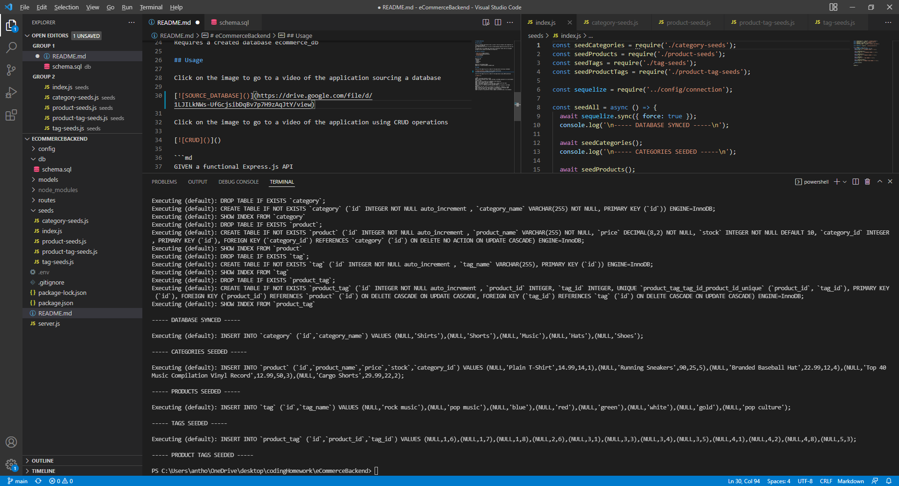

# eCommerceBackend

## Description

This is a backend application that is used to look at products and categories of a commercial website.
This application was built to work on understanding sequilize and how you can use it.
I learned how to use CRUD when referring to different routes that can navigate through an API created with MySQL and sequilize.

## Table of Contents

- [Description](#description)
- [Installation](#installation)
- [Usage](#usage)

## Installation

Requires npm  
* express
* dotenv
* sequelize
* mysql2

Requires the database MySQL  
Requires a created database ecommerce_db

## Usage

Click on the image to go to a video of the application sourcing a database

[](https://drive.google.com/file/d/1LJILkNWs-UfGcjsibDqBv7p7H9zAqJtY/view)

Click on the image to go to a video of the application using CRUD operations

[](https://drive.google.com/file/d/1Ma-W7szWdrGeQH8d_RmE2fGLLiTMgzHt/view)

Click on the image to view Product Get, Post, Delete

[](https://drive.google.com/file/d/1-7gnkFUivJLrKxTpoCjqwIZIsCIrOGPl/view)

```md
GIVEN a functional Express.js API
WHEN I add my database name, MySQL username, and MySQL password to an environment variable file
THEN I am able to connect to a database using Sequelize
WHEN I enter schema and seed commands
THEN a development database is created and is seeded with test data
WHEN I enter the command to invoke the application
THEN my server is started and the Sequelize models are synced to the MySQL database
WHEN I open API GET routes in Insomnia for categories, products, or tags
THEN the data for each of these routes is displayed in a formatted JSON
WHEN I test API POST, PUT, and DELETE routes in Insomnia
THEN I am able to successfully create, update, and delete data in my database
```