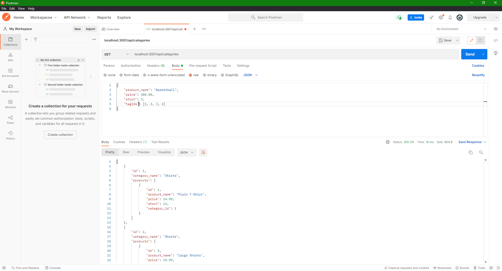

# eCommerceBackend

## Description

This is a backend application that is used to look at products and categories of a commercial website. 
This application was built to work on understanding sequilize and how you can apply it to MySQL databases. 
By using CRUD operations, the eCommerce data can be navigated through and manipulated as we like. 

## Learned

- Create database with MySQL and sequilize
- Create model data amd schema relationships with sequelize
- Create seed data with sequelize
- Link files through index.js to control easier module exporting
- Using asynchronous functions to allow code to execute
- Use CRUD when referring to different routes

## Table of Contents

- [Description](#description)
- [Learned](#learned)
- [Installation](#installation)
- [Usage](#usage)
- [Credits](#credits)
- [Features](#features)

## Installation

**.env file required**

1. Create .env folder within root
2. Layout: 
DB_USER='' 
DB_PW='' 
DB_NAME='ecommerce_db' 
3. Use your MySQL username for DB_USER
4. User your MySQL password for DB_PW 

NPM | Notes
--- | --- 
express | Connection to locally hosted server
dotenv | Allows for enviornment files to be accessed
mysql2 | MySQL package to access database
sequelize | MySQL package to allow for cleaner coding

Database | Database name (required)
--- | ---
MySQL | ecommerce_db

## Usage

After acquiring code and installing all dependencies, connect to and create database  
by running `npm run seed` within the terminal. The application needs data 
to be able to function properly. 

_Click on the image to go to a video of the application sourcing a database_

This application connects to a local host server after running `node server` or  
`npm run start` within the terminal. From here we can open postman or insomnia. 
While in postman or insomnia the created routes can be used for CRUD operations. 

_Click on the image to go to a video of the application using CRUD operations_

_Click on the image to go to a video of more CRUD operations_

## Credits

Code by: Anthony Ditore 
Github: [aditore](https://github.com/aditore) 

## Features

- MySQL database